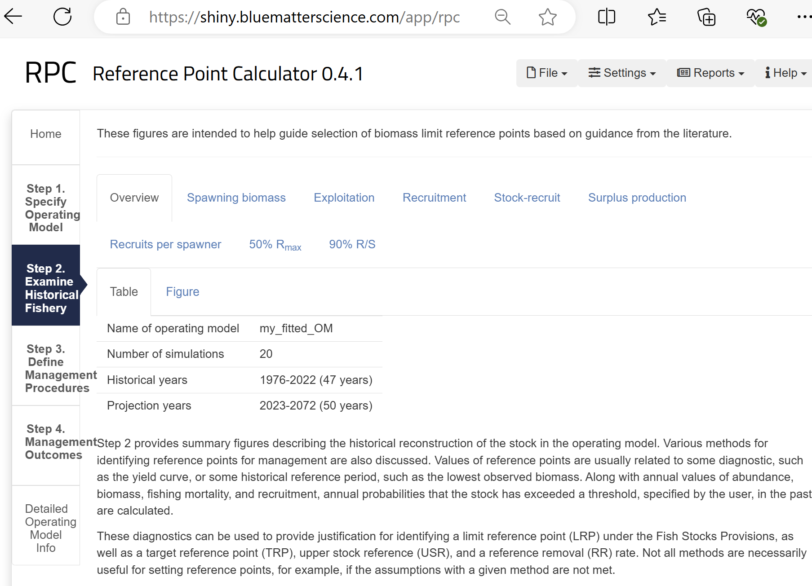

<style type="text/css">

pre code {
  word-wrap: normal;
  white-space: pre;
}
body{ /* Normal  */
   font-size: 12px;
}
td {  /* Table  */
   font-size: 9px;
}
h1 { /* Header 1 */
 font-size: 18px;
 color: DarkBlue;
}
h2 { /* Header 2 */
 font-size: 15px;
 color: DarkBlue;
}
h3 { /* Header 3 */
 font-size: 14px;
 color: DarkBlue;
}
code.r{ /* Code block */
  font-size: 10px;
}
pre { /* Code block */
  font-size: 10px;
  overflow-x: auto;
}
</style>


&nbsp;


```{r, include = FALSE}
knitr::opts_chunk$set(
  collapse = TRUE,
  comment = "#>"
)
knitr::opts_chunk$set(dpi=85, fig.width=7.5, fig.height = 5)
library(RPC)
library(openMSE)
library(Inverts)
library(Inverts.GD)
library(Inverts.MC)
```
<br>
<hr>


# Foreword

Fisheries for hand-harvested invertebrates (HHI) present opportunities and challenges for science and management that are often not pertinent to fisheries for pelagic finfish. 

Populations at the scale of the B.C. coastline are likely to have regional sub-population dynamics at varying spatial scales with uncertain larval dispersal and exchange of biomass. Data on HHI may come from a mix of commerical, recreational and organized scientific surveys that are often not available for earlier time periods of substantial exploitation. 

While aspects of population dynamics and structure may be highly uncertain, the prescriptive nature of management measures (e.g. minimum size limits, rotational spatial closures, gear restrictions) for HHI could be highly robust and support the sustainable exploitation of productive stocks. 

This research and decision support tools use operating models and MSE (Management Strategy Evaluation) simulation testing to characterize scientific uncertainty to inform robust management decision making. 

<br>
<hr>


# Objective of this document

This document is intended to describe the decision support tools and guide prospective users through various aspects of MSE analyses providing examples on how to:

* specify and condition operating models
* calculate reference points
* modify operating models
* define and calculate management performance metrics
* design and test management procedures 
* produce their own plots and diagnostics

<br>
<hr>


# Version Notes 

The package is subject to ongoing testing and development. If you find a bug or a problem please send a report to <tom@bluematterscience.com> so that it can be fixed!  

<br>
<hr>


# Introduction

## Hand Harvested Invertebrates

As part of the approach to meeting the Fish Stocks provisions (FSP) in the revised Fisheries Act, DFO’s Marine Invertebrate Section (MIS) has been adapting the Management Procedure (MP) Framework (Anderson et al. 2021), a decision support tool, to support investigation of management decisions related to conservation objectives for Pacific marine invertebrates. This project will result in a decision support tool  for exploring impacts of spatial closures (Marine Spatial Planning) and other management actions, in order to better understand trade-offs for decision makers under future marine ecosystem and human use (primarily fishing) scenarios.  

These libraries adapt existing tools of the MP Framework to: define reference case and robustness operating models (OMs); define quantitative performance metrics; test alternative management procedures, calculate appropriate reference points, with management options relevant for marine invertebrates; and determining additional management objectives beyond the FSP for the four case studies (Geoduck, intertidal clams, Green Sea Urchin, and Giant Red Sea Cucumber).


## Background information

Project information, links and results are available from a [project webpage](https://mis-assess.github.io/csrf_hh_io/3369975a9851e6fd41a0ae6865456662040af596/index.html)


## Software

The [openMSE R package](https://openmse.com) was used to organize fishery data, define operating models, condition operating models to data, calculate reference points and specify and test existing and alternative management options. 

The [Rapid Conditioning Model](https://openmse.com/tutorial-rcm/) was used to fit operating models to observed data. 

[Reference Point Calculator (Huynh et al. )](https://shiny.bluematterscience.com/app/rpc) was used to explore fishery reference points

<br>


Objects and code are organized into a generic package 'Inverts' and a series of species-specific packages (e.g., Inverts.GD, Inverts.MC, Inverts.GSU, Inverts.SC for geoduck, manila clam, green sea urchin and sea cucumber, respectively).

Organizing the packages this way means that unnecessary objects do not need to be loaded when working on a particular species. Additionally the framework can be scaled to new species and allows for individual improvements to particular species without impacting the other packages. 

```{r Rpackages, eval=T,echo = FALSE}
dat<-data.frame(c("Inverts","Inverts.GD", "Inverts.MC", "Inverts.GSU", "Inverts.SC"),
                
                 c("The umbrella R package containing generic code and example objects for each case study stock",
                   "Data, operating models and tools specific to Geoduck",
                   "Data, operating models and tools specific to Manila Clam",
                   "Data, operating models and tools specific to Green Sea Urchin",
                   "Data, operating models and tools specific to Giant Red Sea Cucumber"))

kableExtra::kable(dat,"simple",col.names=rep("",2)) 
 

```

<br>

Data, operating models, analyses and R packages are stored on the following GitHub repositories

```{r GitHub, eval=T,echo = FALSE}

dat<-data.frame(c("mis-assess/csrf_hh_data","mis-assess/csrf_hh_io","blue-matter/Inverts","blue-matter/Inverts.GD", "blue-matter/Inverts.MC", "blue-matter/Inverts.GSU", "blue-matter/Inverts.SC"),
                   c("Raw data, background analyses, supporting documentation for project",
                   "Project splash page",
                   "Inverts R package",
                   "Inverts.GD R package",
                   "Inverts.MC R package",
                   "Inverts.GSU R package",
                   "Inverts.SC R package"), 
                   c("Private",rep("Public",6)))

kableExtra::kable(dat,"simple",col.names=rep("",3))

```

<br>
<hr>


# Installation

1. Install [R for Windows](https://cran.r-project.org/bin/windows/)

2. Install [RStudio](https://www.rstudio.com/products/rstudio/download/)

3. Install openMSE and devtools packages

Open RStudio and enter the following commands into the console:

```{r install_openMSE_devtools,eval=F}
install.packages('openMSE')
install.packages('devtools')
```

4. Install github packages including the Inverts and RPC R packages by opening RStudio and entering the following commands at the R console :

```{r install_github_packages,eval=F}
devtools::install_github("blue-matter/RPC") 
devtools::install_github("blue-matter/Inverts") 
```

5. Install any species specific packages

```{r install_species_packages,eval=F}
devtools::install_github("blue-matter/Inverts.GD") # Geoduck
devtools::install_github("blue-matter/Inverts.MC") # Manila clam
```

6. Check that the installation is successful by finding this help file (the Inverts vignette):
```{r load_library, eval=F}
library(Inverts)
vignette('Inverts')
```

If you have any difficulties please send an inquiry including some reproducible code to: tom@bluematterscience.com

<br>
<hr>


# Quick start: run an MSE with pre-specified objects

Load libraries: 

```{r QS_load, eval=F}
library(Inverts)
library(Inverts.MC)
```

Locate a stock to work with: 

```{r QS_about, eval=T, out.width="50%", out.height="50%",}
objs('In')         # objects of class input ('In')
about(In.MC.E)     # where is this?
```

Condition an operating model for Manila Clam in CMA E and plot the fit:

```{r QS_fit, eval=F}
myfit = cond.MC(In.MC.E) 
plot(myfit)

```

Build the historical simulation:

```{r QS_hist, eval=F}
Hist = runMSE(myfit@OM, Hist=T)
```

Calculate historical levels relative to reference points:

```{r QS_RPs, eval=T, out.width="50%", out.height="50%", fig.height = 7}
RPs = Ref.Points(Hist)
```

Quantify current stock status:

```{r QS_Status, eval=T, out.width="50%", out.height="50%", fig.height = 5}
Status(Hist)
```


Simulation test status quo fishing pressure / catches and reference fishing:

```{r QS_stat_quo_mse, eval=F, out.width="50%", out.height="50%", fig.height = 5}
myMSE = Project(Hist, c('MP.MC',               # status quo manila clam management
                        "FMSYref50",           # perfect implementation of 50% FMSY fishing
                        "CurC"))               # constant current catch levels
```
Plot projected SSB and exploitation relative to MSY levels:

```{r QS_stat_quo_mse_plot, eval=T, out.width="50%", out.height="50%", fig.height = 5}
Splot(myMSE)
```

Status at the end of the projection:

```{r QS_stat_quo_mse_dfo, eval=T, out.width="50%", out.height="50%", fig.height=8, fig.width=6}
DFO_proj(myMSE)
```

Tabulation of DFO-related probabilities:

```{r QS_tab_MSE_MC_1, eval=T, out.width="50%", out.height="50%",fig.height=6, fig.width=6}
DFO_tab(myMSE)[1:3,] # ?DFO_tab to find out more
```


<br>
<hr>


# Specifying Operating Models

## Objects and data

The Inverts package includes all of the generic functions for searching for objects, interrogating operating models,  running MSEs and plotting results. 

The package comes with reference operating models (class OM) already conditioned for each species (e.g. OM_GD_7 is the operating model for Geoduck in management area 7).

You can search the loaded Inverts packages for any object of a given class using the objs() function:


```{r objs}
library(Inverts)
objs('OM')  # lists all objects of class 'OM' in the loaded Inverts packages
```

When you load a species-specific library, you get bespoke input files (class 'In') and functions specific to that species:

```{r objs_species_specific}
library(Inverts.GD)   # load the geoduck library
objs('In')  # lists all objects of class 'In' in the loaded Inverts packages
```

Input object are specific to a particular region. You can plot the areas and some details of the operating models using the about() function:

```{r about_1, out.width="50%", out.height="50%"}
about(In.GD.7)  # Plot some information about the input object
```


This also works for operating model objects which may have more information if they have been conditioned on data (such as unfished recruitment R0 (millions) and stock depletion (recent SSB relative to unfished):

```{r about_2, out.width="50%", out.height="50%"}
about(OM.MC.E)  # Plot some information about an operating model 
```

If you don't want the figure and just want the data you can alter some arguments of the about function

```{r about_3, out.width="50%", out.height="50%"}
about(OM.GD.7, plot.fig = F, ret.dat = T)  # Extract only the data
```

Remember all of the functions are documented and can be accessed with the  ? operator:


```{r about_4, eval=F}
?about
```

The input objects are the smallest and most concise basis for creating operating models and MSE analyses in a reproducible way. These objects contain the parameters and data required to condition operating models using the Rapid Conditioning Model (RCM) of OpenMSE. 


```{r In_objs,eval=F}
names(In.GD.7)             # slot 1 is the name, slot 2 is the OM parameters, slot 3 contains the data
class(In.GD.7$OM)          # this object is of class 'OM' for operating model, containing all parameters for the OM
class?OM                   # find out more about this class

class(In.GD.7$RCMdata)     # this object is of class 'RCMdata', containing all fishery data used for conditioning the OM
class?RCMdata              # find out more about this class

slotNames(In.GD.7$RCMdata) # list all the data types included in the object
In.GD.7$RCMdata@Chist      # the historical catches
```

## Conditioning operating models

Using these input objects you can condition an operating model for this stock unit. The reason this is done at this level (we don't provide pre-fitted OMs, other than the demonstration reference operating models in the Inverts package) is because you require control over the number of simulations to run. For example, in this script or a workshop we might wish to demonstrate functionality quickly using only a few simulations. In a setting where management advice is to be followed you might want 200+ simulations. 

Each input object has up to 500 simulations already specified. 

You can select a number of simulations and then condition an operating model. In this case we are using a function from the Geoduck package 'Inverts.GD'. This conditioning function is bespoke and include features for model specification, fitting and acceptance/rejection that are specific to Geoduck. Other species have similar functions (e.g. cond.MC() for manila clam). 

This code might take a few minutes to run. To speed up this calculation and all of the other parts of this tutorial we are going to specify only 24 simulations:

```{r Condition_MC, eval=F}
?cond.MC()
myfit = cond.MC(In.MC.E, sims=24)
```

Once you have a fitted operating model the first thing you might wish to do is visualize the data, fit to data and model estimates:

```{r plot_RCMfit, eval=F}
plot(myfit)
```

Alternatively, you could focus on the operating model characteristics including those parts of the operating model that simulate data and implement advice:

```{r plot_RCMfit-OM, eval=F}
plot(myfit@OM)
```

<br>
<hr>

# Calculating reference points

## The Inverts Package

The Inverts package contains functions for the extraction and plotting of management reference points. 

Firstly, you need to reconstruct the historical fishery in your R session using the runMSE() function with argument Hist=T. This means that the historical spool-up period of the operating model (before you were do to management projections) is calculated including a very wide range of reference points and quantities relating to reference points.

In later steps, projections will be undertaken to test management options (data quality, management procedures etc). By pre-calculating the historical stock and reference points, you don't have to do this every time you do a projection (historical dynamics are fixed for each operating model) which makes simulation testing faster. 

```{r do_Hist, eval=F}
Hist = runMSE(myfit@OM, Hist=T)
```

You can obtain a tabulated summary of reference points for a Hist object using the Ref.Points function:

```{r RefPts1, eval=T, out.width="50%", out.height="50%", fig.height = 7}
RPs = Ref.Points(Hist) 
names(RPs)                 # names of listed reference points
head(RPs$SSB_SSB0)         # start of the biomass relative to unfished entry
```

You can also use the internal plotting function on any of these tables if you want a single plot:

```{r RefPts2, eval=T, out.width="50%", out.height="50%", fig.height = 3}
RefPlot(RPs[[3]],names(RPs)[3])

```

For a summary of stock status in the most recent historical year two functions are provided:

```{r RefPts3, eval=T, out.width="50%", out.height="50%", fig.height = 4}
Status(Hist) # provides all the estimated values of SSB and F relative to reference points 

```

```{r RefPts4, eval=T, out.width="50%", out.height="50%", fig.height = 5}
DFO_status(Hist) # plot estimated values of SSB and F relative to reference points on standard DFO regions 

```

If you would rather access all the raw data yourself, these are available in the Hist object in the following slots:

```{r RefPts_custom, eval=T}
names(Hist@TSdata)                  # Time series data like F (Find) and spawning biomass (SSB)
names(Hist@Ref$ReferencePoints)     # Equilibrium reference points (parameters for most recent historical year)
names(Hist@Ref$ByYear)              # Equilibrium reference points calculated from parameters in each historical year
names(Hist@Ref$Dynamic_Unfished)    # Dynamic reference points (assuming no fishing for all years) 

```

It is possible to compare biological status across various operating models. Lets fit a second one and do the historical spool up:

```{r RefPts_across_OMs_run, eval=F}
myfit2 = cond.MC(In.MC.C)
Hist2 = runMSE(myfit2@OM)

```

Now we can compare the current biomass estimate among the operating models:

```{r RefPts_across_OMs, eval=T, out.width="50%", out.height="50%", fig.height = 4}

DFO_status_comp(list(Hist,Hist2))

```

## The Reference Point Calculator (RPC) Package

Reference Point Calculator (Huynh et al. 2022) is an R package and App designed for the exploration of reference points and the testing of management procedures / Harvest Control Rules (HCRs). The package was developed as part of a DFO grant and allows for the calculation of a very wide range of reference points. 

Many of the RPC plotting functions use objects of class 'Hist' that are historical reconstructions of the type calculated above (using runMSE(OM, Hist=T)). 


If you want a summary of the historical stock dynamics:

```{r RPC_hist, eval=T,out.width="50%", out.height="50%"}
hist_bio(Hist)
```

Also available are the yield curves (equilibrium catches at various population / exploitation levels):

```{r RPC_yieldcurves, eval=T,out.width="50%", out.height="50%"}
# hist_YieldCurve(Hist)
```

Here we plot the SSB history relative to MSY:

```{r RPC_SSB, eval=T,out.width="50%", out.height="50%"}
LRP_SSBMSY(Hist)
```

Exploitation rate relative to FMSY:

```{r RPC_F, eval=T,out.width="50%", out.height="50%"}
LRP_FMSY(Hist)
```

Spawning Potential Ratio:

```{r RPC_SPR, eval=T,out.width="50%", out.height="50%"}
LRP_SPR(Hist)
```

The historical recruitment:

```{r RPC_Rec, eval=T,out.width="50%", out.height="50%"}
LRP_R(Hist)
```

Spawning stock biomass (SSB) relative to the (mean) SSB corresponding to 50% max recruitment: 

```{r RPC_50Rmax, eval=T,out.width="50%", out.height="50%",fig.height=3}
LRP_50Rmax(Hist)
```

Historical surplus production: 

```{r RPC_SP, eval=T,out.width="50%", out.height="50%", fig.height=3}
LRP_SP(Hist)
```


## The Reference Point Calculator online App

The operating model is fully compatible with the shiny app [Reference Point Calculator](https://shiny.bluematterscience.com/app/rpc) to provide a very comprehensive report on ALL fishery reference points ever described (including the various plots above) and also allows for the testing of management procedures. 

To use the app you should save the operating model object to your computer, open the app link above and then upload your saved operating model object:

```{r RPC-export, eval=F}
saveRDS(myfit@OM, file="C:/temp/my_fitted_OM.rds") # this is the file you upload to the RPC app
```



<br>
<hr>


# Testing management procedures

## Running simulations

Each species-specific R package has a dedicated 'status quo' management procedure. These can be easily found using the list objects function objs(). 

```{r In_MPs1, eval=T}
objs('MP')  # invertebrates MPs
```

Many other MPs that are available for testing (from the openMSE libraries) can be found using the avail() function: 

```{r In_MPs2, eval=T}
avail('MP') # all MPs that have been loaded included those with openMSE pacakages
```

Most of these are reference MPs (e.g., curE - fishing at current effort levels, FMSYref75 - fishing at 75% of perfectly known FMSY, NFref - no fishing) or 'data limited' MPs (e.g. DBSRA, DCAC, AvC, BK_ML). There are however a handful of data rich MPs that are full stock assessments so that it is possible to quantify the benefit of moving towards more analysis-heavy types of management (e.g., SP_MSY, DDSS_MSY, SCA_MSY etc.). 

The invertebrate-specific MPs (e.g. MP.MC) are designed to closely follow existing management measures but have sufficient flexibility to accommodate a wide range of modifications so that management alternatives can be investigated (more on that below in the 'Specifying management options' section)

Running MSE projections uses the Project() function, where the historical simulation object (we made Hist earlier) is projected for at least one management scenario. Note that each simulation of this projection is identical in terms of recruitment deviation and observation error - the only difference is the MP, so simulation 1 for the first MP tested can be compared directly with simulation 1 for the other MPs. By sharing the same projected conditions, the relative differences among MPs are revealed more efficiently. 

Here we do a projection of our status quo management MP for manila clam and and reference MP that fishes at half of perfectly know FMSY levels: 

```{r Project_MC_1, eval=F}
myMSE = Project(Hist, c('MP.MC',               # status quo manila clam management
                        "FMSYref50",           # perfect implementation of 50% FMSY fishing
                        "CurC"))               # constant current catch levels
```

The object that was created (myMSE) is of class 'MSE' and contains a wide range of information about the operating model, reference points and the projected simulations:

```{r help_MSE_MC_1, eval=F}
class?MSE
```


## Performance metrics

Since the MSE object contains a comprehensive record of everything that was simulated in the projection, we can produce a large number of possible performance metrics. There are functions that provide outputs specific to particular management authorities. For example, there are DFO-specific plots that reference the probabilty of being in the critical, cautious and healthy zones over the short and long time periods:

```{r tab_MSE_MC_1, eval=T, out.width="50%", out.height="50%",fig.height=6, fig.width=6}
DFO_tab(myMSE)[1:3,] 
?DFO_tab  # to find out more
```

Other outputs include NOAA_plot that shows the probability of not overfishing, probability of being above 50% BMSY (P50), long term yield and the probability catch changes are less than 15% among management updates:


```{r tab_MSE_MC_2, eval=T, out.width="50%", out.height="50%",fig.height=6, fig.width=9}
NOAA_plot(myMSE)

```

## Plotting results

You can visualize some of the MSE outcomes using built-in openMSE plotting functions (basic but fast):

```{r plot_MSE_MC_1, eval=T, out.width="50%", out.height="50%",fig.height=6.5}
Splot(myMSE)
```

There are also a set of DFO figures and diagnostics:

```{r plot_MSE_MC_2, eval=T, out.width="50%", out.height="50%",fig.height=8, fig.width=6}
DFO_proj(myMSE)
```

There are also a set of tradeoff plots that show median yield and biomass outcomes:

```{r plot_MSE_MC_3, eval=T, out.width="50%", out.height="50%",fig.height=6, fig.width=6}
Cplot(myMSE)
```

You do have access to all the data in the MSE object so can plot your own custom plots easily enough:

```{r plot_MSE_MC_4, eval=T, out.width="50%", out.height="50%",fig.height=6, fig.width=6}
Year = myMSE@OM$CurrentYr[1] + 1:myMSE@proyears
matplot(Year,t(myMSE@SB_SBMSY[,1,]),type="l",lty=1, ylab="Spawning biomass relative to BMSY"); grid()
abline(h=1,col="grey",lwd=2,lty=2)
```


## Specifying management options

For example, the MP.MC function (default management procedure for manila clam) has the following arguments:

```{r args_MPMC, eval=T}
args(MP.MC)
```

You can find out what each of these arguments do via the in-line help:

```{r help_MPMC, eval=F}
?MC.MP
```

The next section describes how these generic MPs can be modified to test a wide range of alternative management options. 


<br>
<hr>

# Designing new management procedures

## Status quo and reference management procedures

Before testing alternative management options it is beneficial to understand the range of outcomes that might be possible. Do do this it is advisable to run projections with reference MPs. Here we will evaluate 'no fishing', 'FMSY fishing', and status quo fishing. 


```{r Ref_run, eval=F}
refMSE = Project(Hist, c('MP.MC',               # status quo manila clam management
                        "FMSYref",             # perfect implementation of FMSY fishing
                        "NFref"))              # no fishing
```


Projection plots let us understand how the FMSY and no fishing scenarios bracket our existing status quo management. 

```{r Ref_run_plot, eval=T,out.width="50%", out.height="50%",fig.height=6, fig.width=9}
Splot(refMSE)

```

## Implementing size limits

By default, the manila clam MP imposes a minimum size limit of 35mm and keeps effort at current levels. If you wanted to test an alternative minimum size limit you would alter that particular argument: 

```{r SizeLim25_MPMC, eval=F}
SL25 = MP.MC                   # copy the status quo management procedure
formals(SL25)$Min.size = 25    # set the size limit to 25mm
class(SL25) = 'MP'             # assign your new function the class 'MP'
```

Lets test it out: 

```{r SizeLim25_MSE, eval=F}
SL_MSE = Project(Hist, c("MP.MC","SL25"))

```

```{r SizeLim25_MSE_plot, eval=T, out.width="50%", out.height="50%",fig.height=6, fig.width=9}
Splot(SL_MSE)
```

Because both MPs are fishing much below FMSY the only impact of the size limit change is on the yield. Lets try this again with 25 adn 35mm size limits but with 20x the amount of fishing pressure as today: 


```{r SizeLim25_E20_MPMC, eval=F}
SL25_E20 = SL25                   # copy the basic operating model
formals(SL25_E20)$CEff.Mult = 20    # set the size limit to 25mm
class(SL25_E20) = 'MP'             # assign your new function the class 'MP'
SL35_E20 = MP.MC
formals(SL35_E20)$CEff.Mult = 20
SL_MSE_E20 = Project(Hist, c("SL25_E20","SL35_E20"))

```

```{r SizeLim25__E20_MSE_plot, eval=T, out.width="50%", out.height="50%",fig.height=6, fig.width=9}
Splot(SL_MSE_E20)
```

Now we can see closer to FMSY fishing pressure, more comparable yield outcomes but somwehatever higher biomass outcomes for the higher size limit. 

## Implementing effort limits

Lets say you wanted to test a set of levels for a particular management measure. Here we are going to investigate various levels of current fishing pressure (this could be managed by access limits, seasonal spatial closures, license limits etc). You can see from the code above that this would be cumbersome for more than a few MPs. To avoid the mess, the Inverts package comes with a function for spawning multiple MPs from differing values of a particular argument:

```{r Spawn_effort_MP, eval=F}
Effs = c(1,2,4,8,16)
E_MPs = paste0("E",Effs)
spawnMP("MP.MC", spawnlist = list(CEff.Mult = Effs), spawnnames = E_MPs)

```

Based on our status quo management procedure, in just three lines of code we have successfully made a set of 5 MPs (with names E1, E2, E4, E8, E16) that fish at between 1x and 16x current effort levels. 

We can now test those:

```{r Spawn_effort_MP2, eval=F}
MSE_Eff = Project(Hist, E_MPs)

```

```{r Spawn_effort_MP2_plot, eval=T, out.width="50%", out.height="50%",fig.height=6, fig.width=9}
Splot(MSE_Eff)
```

These plots show the fundamental trade-off between what is taken (yield) and what is left over in the water (biomass). We can created  custom trade-off plot to show this more clearly:

```{r Spawn_effort_MP2_plot2, eval=T, out.width="40%", out.height="40%",fig.height=4, fig.width=4.5}

Exp_longterm_B_BMSY = apply(MSE_Eff@SB_SBMSY[,,30],2,mean)
Exp_longterm_Yield = apply(MSE_Eff@Catch[,,30],2,mean)
plot(Exp_longterm_B_BMSY,Exp_longterm_Yield, col="white");grid()
text(Exp_longterm_B_BMSY,Exp_longterm_Yield, MSE_Eff@MPs)

```


## Index ratio approaches

By default, the invertebrate MPs fish at current fishing effort levels without total allowable catch (TAC) control. You may however wish to invetigate options that explicity set catch limits. The simplest way to do this are empirical management procedures that use data directly and do not require an estimation / assessment step. These are increasingly applied in the management of a very wide range of fish species and their adoption is the principle objective of MSE in most fishery settings. 

The most commonly applied type of empirical  management procedure aims to fish at a stable exploitation rate by setting catch limits to a fixed multiple of a relative abundance index: 


```{r Constant_F_policy, eval=T, out.width="50%", out.height="50%",fig.height=6, fig.width=7,echo=F}
set.seed(1)
ny = 25
yrs = as.numeric(substr(as.character(Sys.time()),1,4))+1:ny
SSBi= (1.5+ sin(seq(0,ny/4,length.out=ny))*trlnorm(ny,1,0.4))
targetF = 0.2
Catch_limit = SSBi*targetF
par(mfrow=c(2,2),mai=c(0.7,0.7,0.05,0.02))
plot(yrs,SSBi,col="red",pch=19,xlab="Year",ylab ="Observed Relative Abundance Index"); grid()
plot(yrs,Catch_limit, col="blue",pch=19, xlab="Year",ylab ="Recommended Catch (Index * target F)");grid()
plot(SSBi, Catch_limit,pch=19,xlab = "Relative Abundance Index",ylab="Recommended Catch (Index * target F)");grid();
plot(SSBi,Catch_limit/SSBi, xlab = "Relative Abundance Index", ylab = "target F (recommended catch / index)",pch=19);grid(); abline(h=targetF,col="orange",lwd=2)

```

Constant exploitation rates already include a degree of precaution since equilibrium sustainable exploitation rates increase exponentially as stocks decline. For example, in most cases it is necessary to fish at levels larger than two or three times FMSY to sustainably deplete a stock below half BMSY:


Nevertheless, in Canada, fisheries management often seeks to impose an additional 'hockey stick' harvest control rule (an algorithm that throttles exploitation rate as stock biomass declines - the green line of the plot above). Hockey stick harvest control rules require control points for the maximum exploitation rate (y axis) and the biomass (x axis) below which exploitation rate is reduced and where exploitation rate is zero. 

```{r Empirical HCR, echo=F,eval=T, out.width="70%", out.height="70%",fig.height=4.2, fig.width=9}
par(mfrow=c(1,2),mai=c(0.9,0.9,0.05,0.02))


col="darkgreen"
plot(c(0,1.6),c(0,0.25),col="white",xlab ="Biomass",ylab="Exploitation rate");grid()
abline(h=0.2,lty=2,col="blue"); text(0.3,0.22,"Max. Expltn. rate",cex=0.9,col="blue")
abline(v=c(0.5,1),lty=2,col="red"); text(1.1,0.245,"Up. Bio. Ctl. Pnt.",cex=0.9,col="red")
text(0.335,0.245,"Low. Bio. Ctl. Pnt.",cex=0.9,col="red")
lines(c(0,0.5),c(0.005,0.005),col=col,lwd=2)
lines(c(0.5,1),c(0.005,0.2),col=col,lwd=2)
lines(c(1,10),c(0.2,0.2),col=col,lwd=2)

col="darkgreen"
plot(c(0,1600),c(0,1),col="white",xlab ="Observed Index of Abundance",ylab="Recommendd Catch / Index");grid()
abline(h=0.8,lty=2,col="blue"); text(450,0.85,"Max. catch / index",cex=0.9,col="blue")
abline(v=c(650,1300),lty=2,col="red"); text(1300,0.95,"Up. index Ctl. Pnt.",cex=0.9,col="red")
text(450,0.95,"Low. index Ctl. Pnt.",cex=0.9,col="red")
lines(c(0,650),c(0.01,0.01),col=col,lwd=2)
lines(c(650,1300),c(0.01,0.8),col=col,lwd=2)
lines(c(1300,10000),c(0.8,0.8),col=col,lwd=2)

```


In the figure above the harvest control rule for which Exploitation rate is a function of biomass (left panel), can be rephrased as an empirical rule based on observed catches and an observed Index of abundance (right panel). The control points are then phrased in terms of the recommended catch per index (exploitation rate) and the index levels below which catches are zero or catch per index is reduced.  

The status quo MPs have the option of specifying control using such a system. The arguments for this function are explained in the help documentation:

```{r args_MP_MC, eval=T}
objs('MP') # what inverts-specific MPs are available?
?MP.MC     # help documentation for MP.GD
args(MP.MC)# a more concise list of arguments to the function
```

To specify the index ratio approach you set the argument TAC.calc equal to 'Ratio'. There are then four arguments that shape the hockey stick control rule: 

* C_I.targ - the maximum catch / index (maximum exploitation rate)
* curI_2_target - a calibration factor that states where the most recent index observation (e.g., 2024) is in relation to a target level. 
* HCR_CP_B - the position of the lower and upper index control points relative to target (e.g. 0.5 and 1)
* (optionally) HCR_CP_TAC - position of the lower and upper catch per index control points (default to 0 and 1 as seen in the figure above)

```{r args_MP_MC2, eval=F}
myIR = MP.MC
formals(myIR)$TAC.calc = "Ratio" # Empirical index-ratio approach (the default is 'NaN' - no TAC limits, only effort)
formals(myIR)$C_I.targ = 1       # Aiming to fish at the current catch per index level
formals(myIR)$curI_2target = 2   # The stock (as indicated by the index) is currently twice a calibration level (lets say BMSY) 
formals(myIR)$HCR_CP_B = c(0.5,1)# Control points are 0.5x and 1x BMSY (calibrated according to curI_2target above)
formals(myIR)$HCR_CP_TAC = c(0,1)# Zero fishing below lower control point, current catch/index above upper control point
class(myIR) = "MP"               # make sure it is of OpenMSE class 'MP'
```

If you wanted a constant exploitation rate policy you would either specify both biomass control points at the origin: 

```{r args_MP_MC3, eval=F}
formals(myIR)$HCR_CP_B = c(0,0) # Lower and upper biomass control points are at the origin = constant catch per index. 

```

or make both exploitation rate control points at the same level: 

```{r args_MP_MC4, eval=F}
formals(myIR)$HCR_CP_TAC = c(1,1)# Lower and upper exploitation rate control points are the same = constant catch per index

```

These constant exploitation rate policies are worth investigating particularly for short-lived species where natural processes contribute substantially to variability in stock levels, lower constant exploitation rate policies (essentially no HCR) often out-perform hockey stick control rules that have much higher catch variability for insubstantial gains in yields. Constant exploitation rate policies are a feature of management procedures adopted for a range of pelagic fish species ranging from Peruvian anchoveta to Atlantic bluefin tuna. 


## Index target approaches

An alternative to empirical rules aiming for constant exploitation rate are MP that aim for a particular index level. These may be more appropriate in situations where there is variability in the sustainable rate of exploitation (due to changes in, for example, somatic growth, natural mortality rate, fishery size or age selectivity). 

The index target approaches make changes to the catch advice to reach the target index level. These rules only ask for a target index level 'I.targ':


```{r args_MP_MC_target, eval=F}
myIT = MP.MC
formals(myIT)$TAC.calc = "Target"     # Empirical index-ratio approach
formals(myIT)$I.targ = 1360           # Target index level
class(myIT) = "MP"

```


## Index slope approaches

In cases where you wish to maintain a trajectory in stock biomass at some level, an alternative to index target MPs are index slope MPs. Similarly to the index target approaches you must specify a target slope ('IS.targ') and two other arguments that control the calculation of the slope ('IS.yrs') and the responsiveness of the MP ('IS.fac'):

```{r args_MP_MC_slope, eval=F}
myIS = MP.MC
formals(myIS)$TAC.calc = "Slope"     # Empirical index-ratio approach
formals(myIS)$IS.targ = 0            # Stable stock levels 
formals(myIS)$IS.fac = 1             # TAC changes are proportional the slope change (e.g. a 10% reduction in TAC for a 10% decline in index slope below target levels)
class(myIS) = "MP"
```

## Stock assessments 

Management procedures can include estimation models that aim to mimick the real stock assessment processes. These are sometimes referred to as 'model-based MPs'. 

Even in situations where stock assessments are not possible for data, logistical or management reasons, it may be desirable to evaluate their potential performance (perhaps as a yardstick for current approaches). In MSE projections, all data are simulated including types that may not be currently available. That allows for the theoretical testing of alternative more data intensive options. 

The OpenMSE libraries come with a range of prespecified data-rich assessment MPs that include state-space surplus production (SP), state-space delay differential (DDSS) and statistical catch at age (SCA) models. A few derivatives are available that fish at constant FMSY ('_MSY'), constant 75% of FMSY ('_75MSY') and use a 40-10 HCR ('_4010', FMSY above 40% B0, zero fishing below 10% B0):

```{r args_MP_MC_datarich, eval=F}
avail('MP')
?SCA_MSY
?DDSS_75MSY
?SP_4010
```

You can however design your own data rich MPs by combining assessments (class 'Assess') with HCRs (class 'HCR'):

```{r args_MP_MC_makeMP, eval=F}
avail('Assess')
avail('HCR')
SP_Fox_40_10 = make_MP(SP_Fox,HCR40_10) # combination of the Fox surplus production model and the 40_10 HCR
```

You can also make your own MPs with HCRs that have custom control points:

```{r args_MP_MC_makeMP_customHCR, eval=F}
myMP_HCR = make_MP(SCA, HCR_segment, # HCR segment has arguments (below) for the control points 
                   OCP_type = "SSB_SSBMSY", # independent variable (x axis) is spawning stock biomass relatie to MSY levels
                   Ftarget_type = "FMSY", # dependent variable (y axis) of HCR is F relative to FMSY
                   OCP = c(0.1,0.4),      # lower and upper control points are 10 and 40 percent of SSB
                   relF = c(0,1))

class(myMP_HCR)
```

## Short-cuts

Running model-based MPs can be computationally intensive. An alternative is to take the control points of an HCR not from an estimation model but from the operating model directly assuming some realistic level of observation (data going into the assessment) and estimation error (error in estimates of control points of an HCR in this context). Because there is no estimation, short-cuts can provide indicative results in a small fraction of the time as the full model-based MP. 

```{r shortcut, eval=F}
my_SC_4010 = make_MP(Shortcut, HCR40_10, # HCR segment has arguments (below) for the control points 
                   method = "N", # stock numbers enter the HCR
                   N_err = c(0.1, # 10% coefficient of variation (precision)
                             0.2, # 20% lag-1 autocorrelation in error
                             1))  # Unbiased on average (1.1 would be 10% positively biased)

class(my_SC_4010)
```

## Idealized management 

Short cut methods provide a way to create idealized 'perfect information' management (i.e. setting the errors to very low levels:

```{r Perfect_methods, eval=T}
tiny = 1E5
perfect_4010 = make_MP(Shortcut, HCR40_10, # HCR segment has arguments (below) for the control points 
                   method = "N",   # stock numbers enter the HCR
                   N_err = c(tiny, # highly precise
                             tiny, # no lag
                             1))   # Unbiased
```

There are also some specified perfect information MPs that fish at a fraction of FMSY:

* FMSYref, FMSYref75, FMSYref50


## Additional TAC control parameters

When using the specified MPs such as There are a number of other arguments that apply to all methods of catch advice (TAC.calc is set to 'Slope','Target' or 'Rate') that provide additional control over TAC changes. These include:

* max TAC - that highest TAC level that is recommended by the MP
* minTAC - the lowest TAC level that is recommended by the MP
* TACdec - the highest fractional TAC decline that the MP can make (e.g. 0.2 means that TAC(y) must be higher than 0.8 x TAC(y-1))
* TACinc - the highest fraction TAC increase that the MP can make (e.g. 0.3 mean that TAC(y) must be lower than 1.3 * TAC(y-1))
* I.enp - Indices are processed via a polynomial smoother to try to remove noise from signal. The degree of smoothing is controlled by this parameter. ENP stands for effective number of parameters per datum. So higher ENPs are more closely fitting (less smooth) polynomials. The default of 0.25 means that for every 4 data points the polynomial adds another parameter for smoothing. 
* I_freq - the frequency that the indices will be observed in the forward projection. Let us assume there are three indices available a vector I_freq = c(1,3,0) would mean that there would be an observation every year for index 1, a new observation every three years for index 2, and no new data for index 3. 
* calib_yrs - the number of years used to define 'recent historical levels'. When arguments such as curI_2_target are used, they determine 'current' based on the calib_yrs number of years in the historical time period. So for example if the OMs were fitted to 2023 and calib_yrs was set to 3, the MP would use years 2021-2023 to determine 'recent' index and catch levels. 


## Other management levers

The default MPs (e.g. GC.MP, MC.MP, GSU.MP, RSU.MP) assume that current fishing effort (days per year) will be the same in the future. You can explore alternative effort scenarios with the 'Effort' argument. 

A default discarding rate and post-release mortality rate are also assumed. The shift to a new gear might be expected to change both of these. These are easily changed:


```{r Eff_DR_Fdisc, eval=F}
new_gear_MP = RSU.MP
formals(new_gear_MP)$Effort = 0.9 # a 10% decline in effort is expected
formals(new_gear_MP)$DR = 0.15    # 15% of the catch (numbers) is expected to be discarded 
formals(new_gear_MP)$Fdisc = 0.8  # only 20% of discards are expected to survive
class(new_gear_MP) = "MP"

```


# Species-specific considerations

Some species are managed in a unique way that requires some specification of operating model and management procedure features. Those are described here.

## Rotational closures

In some areas, species such as Geoduck and Cucumber are managed using rotational closures. This means that management procedures for these species are set up to try and identify the recent cycle of closures and maintain this in future years. These MPs (MP.GD an MP.RSC) can also be specified with a user defined pattern of closures using the 'rotation' argument:

```{r SpecSpec_geoduck, eval=F}
?MP.GD
myGD = MP.GD
formals(myGD)$rotation = rep(c(1,1,0),100)[1:OM.GD.7@proyears] # twice open for every year closed for the projected years (starting, open, open, closed)
```

A subtlety of geoduck and red sea cucumber operating models is that the observation error model is disrupted by the on/off nature of historical catch observations. You need to specify these on the Hist object before you do projections, for example:

```{r SpecSpec_geoduck_obs, eval=F}
Hist = runMSE(OM.GD.7,Hist=T)
newHist = Obs.GD(Hist, Catch_CV = 0.02, Catch_bias = 1) # catch observations are unbiased with a 2% CV
testy = Project(newHist,"MP.GD")
```


# Modifying and reconditioning operating models

## Input object configuration

Input objects contain all of the parameters and data required to condition an operating model using the species-specific conditioning function (e.g., cond.MC, cond.GD, cond.GSU, cond.RSC). 

You can list the available input objects using the objs() function:

```{r Input_objects, eval=T,echo=T, out.width="50%", out.height="50%",fig.height=3.5, fig.width=7.5}
objs('In')     # all the invertebrate input objects available in this session 
about(In.MC.E) # information about the location and OM for manila clam in clam management area E
```

Input objects are lists that include information about the geographic location of the stock (in this case CMA), the operating model (OM) and the available data (RCMdata):

```{r Input_objects2, eval=T}
class(In.MC.E)
names(In.MC.E)
```

We can make changes to model parameters (OM) or data (RCMdata) by manipulating these input objects. 

## Changing parameters

Operating models are built from the parameter ranges specified in the operating model object and a 'custom parameter' slot in the operating model. 

```{r Input_objects3, eval=T}
myOM = In.MC.E$OM
slotNames(myOM) # most of these are parameter ranges for uniform sampling of values
names(myOM@cpars) # these are higher level, per simulation samples specifed by the user
```

Operating model building first looks for the bespoke inputs of the custom parameters before settling on the parameter ranges. For example the operating models will use OM@cpars$M before they use OM@M:

```{r Input_objects4, eval=T}
validcpars() # list all the custom parameter options
length(myOM@cpars$M) # nsim samples of the instantaneous natural mortality rate
dim(myOM@cpars$SLarray) # fishery selectivity by simulation (500), length class (45) and year (54)

```
If you wanted to create the same OM but with an M value that is 20% lower you would do this:

```{r Input_objects5, eval=T}
myOM = In.MC.E$OM
prevM = In.MC.E$OM@cpars$M
myOM@cpars$M = prevM * 0.8
```

If you wanted to sample your own M distribution and put it in the cpars slot you could do this:

```{r Input_objects6, eval=T,echo=T, out.width="50%", out.height="50%",fig.height=3.5, fig.width=7.5}
nsim = myOM@nsim
myOM@cpars$M = rlnorm(nsim,log(0.31),0.1) # a lognormal distribution with median 0.31 and sd 0.1
hist(myOM@cpars$M )
```


## Adding data / reconditioning operating models

The data used in conditing are stored in the slot RCMdata (rapid conditioning model data object). These data are of class RCMdata and have a defined format. 

```{r Input_data1, eval=T}
mydata = In.MC.E$RCMdata
slotNames(mydata)
class?RCMdata
```

The two principle sources of data in this manila clam data object are historical catches (Chist) and Catch-at-length composition data (CAL) and three indices (Density survey, ICMP and a weak index prior for testing). Chist is a vector n_years long, CAL is a matrix nyears by n_length_categories:

```{r Input_data2, eval=T}
mydata = In.MC.E$RCMdata
myOM= In.MC.E$OM
myOM@nyears                   # the operating model historical time period 
length(mydata@Chist)          # check nyears in the OM matches Chist vector length

length(mydata@length_bin)     # the number of length bins for the length composition data
dim(mydata@CAL)               # check that the dimensions of the CAL data match up
dim(mydata@IAA)               # check index age observations
dim(mydata@Index)              # check that the index data dimensions match up
```

We are going to add some fake data (the mean catch and indices of the historical series, an old year of CAL data) to these datasets to demonstrate how this is done. 

```{r Input_data3, eval=T}
mydata@Chist = c(mydata@Chist, mean(mydata@Chist))
mydata@Index = rbind(mydata@Index,apply(mydata@Index,2,mean,na.rm=T))
mydata@CAL = rbind(mydata@CAL, mydata@CAL[13,]) # 13th year, last year of CAL obs in the dataset is replicated
mydata@IAA = mydata@IAA[c(1:myOM@nyears,myOM@nyears),,] # replicate last year of index age observations

length(mydata@Chist)
dim(mydata@CAL)
dim(mydata@IAA)

```

We have a few things left to do: we need to specify the precision of the new observations of catch and catch-at-length and specify the new number of years in the operating model.

```{r Input_data4, eval=T}
mydata@C_sd = c(mydata@C_sd,mean(mydata@C_sd))
mydata@I_sd = rbind(mydata@I_sd, apply(mydata@I_sd, 2, mean,na.rm=T))
mydata@CAL_ESS = c(mydata@CAL_ESS, mydata@CAL_ESS[13]) # 13th year, last year of CAL age sample size
mydata@IAA_ESS = mydata@IAA_ESS[c(1:myOM@nyears,myOM@nyears),] # replicate last year of index age sample size
myOM@cpars$SLarray = myOM@cpars$SLarray[,,c(1,1:(myOM@nyears+myOM@proyears))] # add another year of size at length
myOM@nyears = myOM@nyears+1 # make sure OM has extra year
myOM@CurrentYr = myOM@CurrentYr+1

```

Now you have a fully specified RCMdata input object and compatible operating model, we can fit the new model and plot results: 

```{r Input_data5, eval=F}
myinput = In.MC.E
myinput$OM = myOM
myinput$RCMdata = mydata
myfit = cond.MC(myinput)

plot(myfit)

```


<br>
<hr>

# Resources

## B.C. Hand-harvested invertebrates splash page

For more information about how operating models were specified for B.C. invertebrates you can visit the [splash page](https://mis-assess.github.io/csrf_hh_io/)

Contact (tom@bluematterscience for password)

## B.C. Hand-harvested invertebrates GitHub repository

All of the code for conditioning operating models can be found at a private [GitHub repository](https://github.com/mis-assess/csrf_hh_data) (contact Mackensie Mazur or Shannon Obradovich for access)

## Inverts R packages

The code for the R packages used in this manaual are available from public GitHub repositories:

* [Inverts](https://github.com/Blue-Matter/Inverts) 
* [Inverts.GD](https://github.com/Blue-Matter/Inverts.GD) 
* [Inverts.MC](https://github.com/Blue-Matter/Inverts.MC)  
* [Inverts.GSU](https://github.com/Blue-Matter/Inverts.GSU)  
* [Inverts.RSC](https://github.com/Blue-Matter/Inverts.RSC)  

## OpenMSE

Visit the [OpenMSE website](https://openmse.com) for more information on the framework including tutorial and case studies.

The Rapid Conditioning Model is also [described there](https://openmse.com/tutorial-rcm)

Other useful openMSE apps include [MERA](https://www.merafish.org/) for rapidly scoping operating models and [Reference Point Calculator](https://shiny.bluematterscience.com/app/rpc) for investigating reference points and control rules. 

## Management Strategy Evaluation

The Ocean Foundation host the [Harvest Strategies website](https://harveststrategies.org/) which is an excellent resource describing MSE, MSE concepts and how MSE can be used in fishery management including introductory videos and interviews with experts. 'Harvest strategy' and Management Procedure are synonymous, by the way. 

<br>
<hr>

# References

Hordyk, A., Huynh, Q., Carruthers, T. 2025. OpenMSE: An open-source R package for Management strategy evaluation, available from: https://openmse.com

Huynn, Q., 2025. Rapid Conditioning model. Available from [https://openmse.com/tutorial-rcm/](https://openmse.com/tutorial-rcm/) 

Punt, A.E., Butterworth, D.S., de Moor, C.L., De Oliveira, J.A.A., and Haddon, M. 2016. Management strategy evaluation: Best practices. Fish Fish. 17(2): 303–334. doi:10.1111/faf.12104. 


```{r, echo=FALSE, eval=FALSE}
sfStop()                            
```

<br>
<hr>

