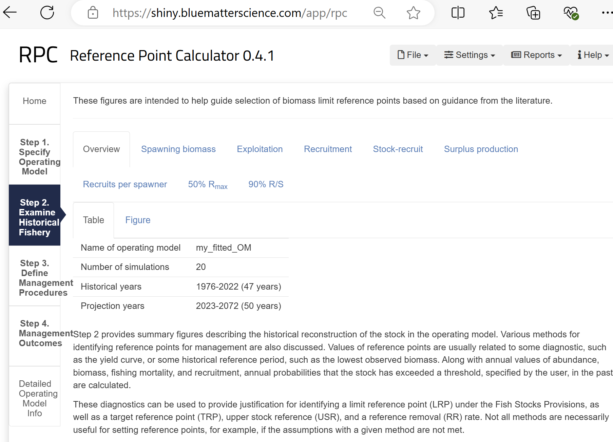

<style type="text/css">

body{ /* Normal  */
   font-size: 12px;
}
td {  /* Table  */
   font-size: 9px;
}
h1 { /* Header 1 */
 font-size: 18px;
 color: DarkBlue;
}
h2 { /* Header 2 */
 font-size: 15px;
 color: DarkBlue;
}
h3 { /* Header 3 */
 font-size: 14px;
 color: DarkBlue;
}
code.r{ /* Code block */
  font-size: 10px;
}
pre { /* Code block */
  font-size: 10px
}
</style>


&nbsp;


```{r, include = FALSE}
knitr::opts_chunk$set(
  collapse = TRUE,
  comment = "#>"
)
knitr::opts_chunk$set(dpi=85, fig.width=7.5, fig.height = 5)
library(RPC)
library(openMSE)
library(Inverts)
library(Inverts.GD)
library(Inverts.MC)
```
<br>

# Foreword

Fisheries for hand-harvested invertebrates (HHI) present opportunities and challenges for science and management that are unlike fisheries for pelagic finfish. Populations at the scale of the B.C. coastline are likely to have regional sub-population dynamics at varying spatial scales with uncertain larval dispersal and exchange of biomass. Data on HHI may come from a mix of commerical, recreational and organized scientific surveys that are often not available for earlier time periods of substantial exploitation. While aspects of population dynamics and structure may be highly uncertain, the prescriptive nature of management measures (e.g. minimum size limits, rotational spatial closures, gear restrictions) for HHI could be highly robust and support the sustainable exploitation of productive stocks. This research and decision support tools use operating models and MSE (Management Strategy Evaluation) simulation testing to characterize scientific uncertainty to inform robust management decision making. 

<br>

# Objective of this document

This document is intended to describe the decision support tools and guide prospective users through various aspects of MSE analyses providing examples on how to:

* specify and condition operating models
* calculate reference points
* modify operating models
* define and calculate management performance metrics
* design and test management procedures 
* produce their own plots and diagnostics

<br>

# Version Notes 

The package is subject to ongoing testing and development. If you find a bug or a problem please send a report to <tom@bluematterscience.com> so that it can be fixed!  

<br>


# Introduction

## Hand Harvested Invertebrates

As part of the approach to meeting the Fish Stocks provisions (FSP) in the revised Fisheries Act, DFO’s Marine Invertebrate Section (MIS) has been adapting the Management Procedure (MP) Framework (Anderson et al. 2021), a decision support tool, to support investigation of management decisions related to conservation objectives for Pacific marine invertebrates. This project will result in a decision support tool  for exploring impacts of spatial closures (Marine Spatial Planning) and other management actions, in order to better understand trade-offs for decision makers under future marine ecosystem and human use (primarily fishing) scenarios.  

These libraries adapt existing tools of the MP Framework to: define reference case and robustness operating models (OMs); define quantitative performance metrics; test alternative management procedures, calculate appropriate reference points, with management options relevant for marine invertebrates; and determining additional management objectives beyond the FSP for the four case studies (Geoduck, intertidal clams, Green Sea Urchin, and Giant Red Sea Cucumber).


## Background information

Project information, links and results are available from a [project webpage](https://mis-assess.github.io/csrf_hh_io/3369975a9851e6fd41a0ae6865456662040af596/index.html)


## Software

The [openMSE R package](https://openmse.com) was used to organize fishery data, define operating models, condition operating models to data, calculate reference points and specify and test existing and alternative management options. 

The [Rapid Conditioning Model](https://openmse.com/tutorial-rcm/) was used to fit operating models to observed data. 

[Reference Point Calculator (Huynh et al. )](https://shiny.bluematterscience.com/app/rpc) was used to explore fishery reference points

<br>


Objects and code are organized into a generic package 'Inverts' and a series of species-specific packages (e.g., Inverts.GD, Inverts.MC, Inverts.GSU, Inverts.SC for geoduck, manila clam, green sea urchin and sea cucumber, respectively).

Organizing the packages this way means that unnecessary objects do not need to be loaded when working on a particular species. Additionally the framework can be scaled to new species and allows for individual improvements to particular species without impacting the other packages. 

```{r Rpackages, eval=T,echo = FALSE}
dat<-data.frame(c("Inverts","Inverts.GD", "Inverts.MC", "Inverts.GSU", "Inverts.SC"),
                
                 c("The umbrella R package containing generic code and example objects for each case study stock",
                   "Data, operating models and tools specific to Geoduck",
                   "Data, operating models and tools specific to Manila Clam",
                   "Data, operating models and tools specific to Green Sea Urchin",
                   "Data, operating models and tools specific to Giant Red Sea Cucumber"))

kableExtra::kable(dat,"simple",col.names=rep("",2)) 
 

```

<br>

Data, operating models, analyses and R packages are stored on the following GitHub repositories

```{r GitHub, eval=T,echo = FALSE}

dat<-data.frame(c("mis-assess/csrf_hh_data","mis-assess/csrf_hh_io","blue-matter/Inverts","blue-matter/Inverts.GD", "blue-matter/Inverts.MC", "blue-matter/Inverts.GSU", "blue-matter/Inverts.SC"),
                   c("Raw data, background analyses, supporting documentation for project",
                   "Project splash page",
                   "Inverts R package",
                   "Inverts.GD R package",
                   "Inverts.MC R package",
                   "Inverts.GSU R package",
                   "Inverts.SC R package"), 
                   c("Private",rep("Public",6)))

kableExtra::kable(dat,"simple",col.names=rep("",3))

```

<br>

# Installation

1. Install [R for Windows](https://cran.r-project.org/bin/windows/)

2. Install [RStudio](https://www.rstudio.com/products/rstudio/download/)

3. Install openMSE and devtools packages

Open RStudio and enter the following commands into the console:

```{r install_openMSE_devtools,eval=F}
install.packages('openMSE')
install.packages('devtools')
```

4. Install github packages including the Inverts and RPC R packages by opening RStudio and entering the following commands at the R console :

```{r install_github_packages,eval=F}
devtools::install_github("blue-matter/RPC") 
devtools::install_github("blue-matter/Inverts") 
```

5. Install any species specific packages

```{r install_species_packages,eval=F}
devtools::install_github("blue-matter/Inverts.GD") # Geoduck
devtools::install_github("blue-matter/Inverts.MC") # Manila clam
```

6. Check that the installation is successful by finding this help file (the Inverts vignette):
```{r load_library, eval=F}
library(Inverts)
vignette('Inverts')
```

If you have any difficulties please send an inquiry including some reproducible code to: tom@bluematterscience.com

<br>

# Quick start: run an MSE with pre-specified objects


<br>

# Specifying Operating Models

## Objects and data

The Inverts package includes all of the generic functions for searching for objects, interrogating operating models,  running MSEs and plotting results. 

The package comes with reference operating models (class OM) already conditioned for each species (e.g. OM_GD_7 is the operating model for Geoduck in management area 7).

You can search the loaded Inverts packages for any object of a given class using the objs() function:


```{r objs}
library(Inverts)
objs('OM')  # lists all objects of class 'OM' in the loaded Inverts packages
```

When you load a species-specific library, you get bespoke input files (class 'In') and functions specific to that species:

```{r objs_species_specific}
library(Inverts.GD)   # load the geoduck library
objs('In')  # lists all objects of class 'In' in the loaded Inverts packages
```

Input object are specific to a particular region. You can plot the areas and some details of the operating models using the about() function:

```{r about_1, out.width="50%", out.height="50%"}
about(In.GD.7)  # Plot some information about the input object
```


This also works for operating model objects which may have more information if they have been conditioned on data (such as unfished recruitment R0 (millions) and stock depletion (recent SSB relative to unfished):

```{r about_2, out.width="50%", out.height="50%"}
about(OM.MC.E)  # Plot some information about an operating model 
```

If you don't want the figure and just want the data you can alter some arguments of the about function

```{r about_3, out.width="50%", out.height="50%"}
about(OM.GD.7, plot.fig = F, ret.dat = T)  # Extract only the data
```

Remember all of the functions are documented and can be accessed with the  ? operator:


```{r about_4, eval=F}
?about
```

The input objects are the smallest and most concise basis for creating operating models and MSE analyses in a reproducible way. These objects contain the parameters and data required to condition operating models using the Rapid Conditioning Model (RCM) of OpenMSE. 


```{r In_objs,eval=F}
names(In.GD.7)             # slot 1 is the name, slot 2 is the OM parameters, slot 3 contains the data
class(In.GD.7$OM)          # this object is of class 'OM' for operating model, an OpenMSE object containing all parameters for the OM
class?OM                   # find out more about this class

class(In.GD.7$RCMdata)     # this object is of class 'RCMdata', an OpenMSE object containing all fishery data used for conditioning the OM
class?RCMdata              # find out more about this class

slotNames(In.GD.7$RCMdata) # list all the data types included in the object
In.GD.7$RCMdata@Chist      # the historical catches
```

## Conditioning operating models

Using these input objects you can condition an operating model for this stock unit. The reason this is done at this level (we don't provide pre-fitted OMs, other than the demonstration reference operating models in the Inverts package) is because you require control over the number of simulations to run. For example, in this script or a workshop we might wish to demonstrate functionality quickly using only a few simulations. In a setting where management advice is to be followed you might want 200+ simulations. 

Each input object has up to 500 simulations already specified. 

You can select a number of simulations and then condition an operating model. In this case we are using a function from the Geoduck package 'Inverts.GD'. This conditioning function is bespoke and include features for model specification, fitting and acceptance/rejection that are specific to Geoduck. Other species have similar functions (e.g. cond.MC() for manila clam). 

This code might take a few minutes to run. To speed up this calculation and all of the other parts of this tutorial we are going to specify only 24 simulations:

```{r Condition_MC, eval=F}
?cond.MC()
myfit = cond.MC(In.MC.E, sims=24)
```

Once you have a fitted operating model the first thing you might wish to do is visualize the data, fit to data and model estimates:

```{r plot_RCMfit, eval=F}
plot(myfit)
```

Alternatively, you could focus on the operating model characteristics including those parts of the operating model that simulate data and implement advice:

```{r plot_RCMfit-OM, eval=F}
plot(myfit@OM)
```


## Calculating reference points

### The Inverts Package

The Inverts package contains functions for the extraction and plotting of management reference points. 

Firstly, you need to reconstruct the historical fishery in your R session using the runMSE() function with argument Hist=T. This means that the historical spool-up period of the operating model (before you were do to management projections) is calculated including a very wide range of reference points and quantities relating to reference points.

In later steps, projections will be undertaken to test management options (data quality, management procedures etc). By pre-calculating the historical stock and reference points, you don't have to do this every time you do a projection (historical dynamics are fixed for each operating model) which makes simulation testing faster. 

```{r do_Hist, eval=F}
Hist = runMSE(myfit@OM, Hist=T)
```

You can obtain a tabulated summary of reference points for a Hist object using the Ref.Points function:

```{r RefPts1, eval=T, out.width="50%", out.height="50%", fig.height = 7}
RPs = Ref.Points(Hist) 
names(RPs)                 # names of listed reference points
head(RPs$SSB_SSB0)         # start of the biomass relative to unfished entry
```

You can also use the internal plotting function on any of these tables if you want a single plot:

```{r RefPts2, eval=T, out.width="50%", out.height="50%", fig.height = 3}
RefPlot(RPs[[3]],names(RPs)[3])

```

For a summary of stock status in the most recent historical year two functions are provided:

```{r RefPts3, eval=T, out.width="50%", out.height="50%", fig.height = 4}
Status(Hist) # provides all the estimated values of SSB and F relative to reference points 

```

```{r RefPts4, eval=T, out.width="50%", out.height="50%", fig.height = 5}
DFO_status(Hist) # plot estimated values of SSB and F relative to reference points on standard DFO regions 

```

If you would rather access all the raw data yourself, these are available in the Hist object in the following slots:

```{r RefPts_custom, eval=T}
names(Hist@TSdata)                  # Time series data like F (Find) and spawning biomass (SSB)
names(Hist@Ref$ReferencePoints)     # Equilibrium reference points (parameters for most recent historical year)
names(Hist@Ref$ByYear)              # Equilibrium reference points calculated from parameters in each historical year
names(Hist@Ref$Dynamic_Unfished)    # Dynamic reference points (assuming no fishing for all years) 

```

It is possible to compare biological status across various operating models:

```{r RefPts_across_OMs, eval=T}
myfit2 = cond.MC(In.MC.C)
Hist2 = runMSE(myfit2@OM)
DFO_status_comp(list(Hist1,Hist2))

```


### The Reference Point Calculator (RPC) Package

Reference Point Calculator (Huynh et al. 2022) is a R package and App designed for the exploration of reference points and the testing of management procedures / Harvest Control Rules (HCRs). The package was developed as part of a DFO grant and allows for the calculation of a very wide range of reference points. 

Many of the RPC plotting functions use objects of class 'Hist' that are historical reconstructions of the type calculated above (using runMSE(OM, Hist=T)). 


If you want a summary of the historical stock dynamics:

```{r RPC_hist, eval=T,out.width="50%", out.height="50%"}
hist_bio(Hist)
```

Also available are the yield curves (equilibrium catches at various population / exploitation levels)"

```{r RPC_yieldcurves, eval=T,out.width="50%", out.height="50%"}
hist_YieldCurve(Hist)
```

Here we plot the SSB history relative to MSY:

```{r RPC_SSB, eval=T,out.width="50%", out.height="50%"}
LRP_SSBMSY(Hist)
```

Exploitation rate relative to FMSY:

```{r RPC_F, eval=T,out.width="50%", out.height="50%"}
LRP_FMSY(Hist)
```

Spawning Potential Ratio:

```{r RPC_SPR, eval=T,out.width="50%", out.height="50%"}
LRP_SPR(Hist)
```

The historical recruitment:

```{r RPC_Rec, eval=T,out.width="50%", out.height="50%"}
LRP_R(Hist)
```

Spawning stock biomass (SSB) relative to the (mean) SSB corresponding to 50% max recruitment: 

```{r RPC_50Rmax, eval=T,out.width="50%", out.height="50%",fig.height=3}
LRP_50Rmax(Hist)
```

Historical surplus production: 

```{r RPC_SP, eval=T,out.width="50%", out.height="50%", fig.height=3}
LRP_SP(Hist)
```


### The Reference Point Calculator online App

The operating model is fully compatible with the shiny app [Reference Point Calculator](https://shiny.bluematterscience.com/app/rpc) to provide a very comprehensive report on ALL fishery reference points ever described (including the various plots above) and also allows for the testing of management procedures. 

To use the app you should save the operating model object to your computer, open the app link above and then upload your saved operating model object:

```{r RPC-export, eval=F}
saveRDS(myfit@OM, file="C:/temp/my_fitted_OM.rds") # this is the file you upload to the RPC app
```




## A guide to the MSE design

### Reference Trials


### Robustness Trials

Here is a figure showing the configuration of the various robustness OMs:


## Running an MSE using pre-specified objects

### Observation models

### Implementation Error models

underages and maximum harvest rates (ie a TAC can be taken up to a maximum harvest rate of 90 per cent).

### Management procedures


### Running a preliminary MSE

Management strategy evaluation is computationally intensive and typically requires the recursive application of 

### MSE outputs


<br>

# Limitations

## Idealised observation models for catch composition data
Currently, catch-composition data  are simulated from the true simulated catch composition data via a multinomial distribution and some effective sample size. This observation model may be unrealistically well-behaved and favour those approaches that use these data.


<br>

#References


```{r, echo=FALSE, eval=FALSE}
sfStop()                            
```

<br>
